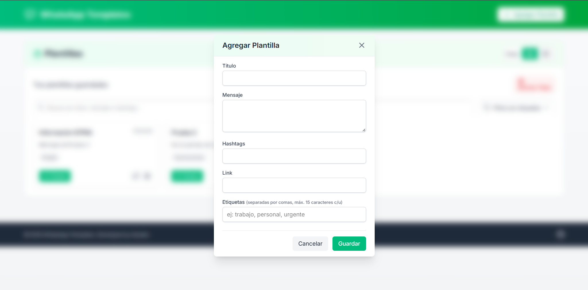
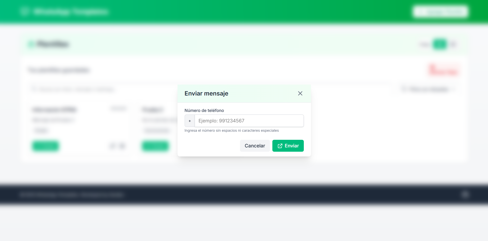
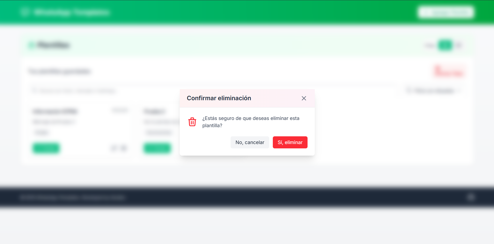

# WhatsApp Templates

<div align="center">
  
  <h3>Gestiona tus plantillas de mensajes para WhatsApp</h3>
  <p>Una aplicación web moderna para crear, organizar y enviar mensajes predefinidos a través de WhatsApp</p>
  
  [](https://tailwindcss.com)
  [](https://developer.mozilla.org/es/docs/Web/JavaScript)
</div>

## 🚀 Demo

¡Prueba la aplicación en vivo! Visita [WhatsApp Templates Demo](https://alexanderg8.github.io/whatsapp-templates/)

## 📋 Tabla de Contenidos

- [Características](#-características)
- [Cómo Usar](#-cómo-usar)
- [Capturas de Pantalla](#-capturas-de-pantalla)
- [Instalación](#-instalación)
- [Tecnologías](#-tecnologías)
- [Documentación Técnica](#-documentación-técnica)
- [Contribuir](#-contribuir)
- [Licencia](#-licencia)
- [Contacto](#-contacto)

## ✨ Características

- **Plantillas Personalizadas**: Crea y guarda mensajes predefinidos para enviar rápidamente
- **Etiquetas y Organización**: Categoriza tus plantillas con etiquetas para encontrarlas fácilmente
- **Búsqueda Inteligente**: Encuentra tus plantillas por título, contenido o hashtags
- **Filtrado por Etiquetas**: Filtra plantillas por una o varias etiquetas simultáneamente
- **Vistas Flexibles**: Alterna entre vista de cuadrícula o lista según tus preferencias
- **Envío Directo**: Envía mensajes directamente a un número específico sin necesidad de agregarlo a tus contactos
- **Persistencia Local**: Tus plantillas se guardan automáticamente en tu navegador
- **Recuperación**: Recupera fácilmente la última plantilla eliminada
- **Diseño Responsivo**: Funciona perfectamente en dispositivos móviles y de escritorio
- **Sin Registro**: No requiere creación de cuentas ni almacenamiento en la nube

## 🔍 Cómo Usar

### Crear una nueva plantilla

1. Haz clic en el botón "Agregar Plantilla" en la parte superior de la página
2. Completa los campos de título, mensaje, hashtags y link (opcional)
3. Agrega etiquetas para organizar tu plantilla (opcional)
4. Haz clic en "Guardar"

### Usar una plantilla

1. Localiza la plantilla que deseas usar
2. Haz clic en el botón "Enviar"
3. Ingresa el número de teléfono al que quieres enviar el mensaje
4. Haz clic en "Enviar" y serás redirigido automáticamente a WhatsApp con el mensaje predefinido

### Buscar y filtrar plantillas

- Usa la barra de búsqueda para encontrar plantillas por texto
- Utiliza el botón "Filtrar por etiquetas" para mostrar solo las plantillas con etiquetas específicas
- Cambia entre vista de cuadrícula y lista con los botones en la parte superior

## 📱 Capturas de Pantalla

<div align="center">
  
  
</div>

<div align="center">
  
  
</div>

## 💻 Instalación

Para usar WhatsApp Templates localmente:

```bash
# Clonar el repositorio
git clone https://github.com/AlexanderG8/whatsapp-templates.git

# Navegar al directorio
cd whatsapp-templates

# Abrir en tu navegador
# Puedes usar cualquier servidor local como Live Server en VSCode
# o simplemente abriendo el archivo index.html en tu navegador
```

## 🛠️ Tecnologías

- **JavaScript Vanilla**: Sin dependencias de frameworks para un código más ligero
- **Tailwind CSS**: Para un diseño moderno y responsivo
- **LocalStorage API**: Para la persistencia de datos en el navegador
- **WhatsApp Web API**: Para la integración con WhatsApp

## 📚 Documentación Técnica

### Implementación del Patrón Store

Este proyecto implementa un patrón Store para la gestión del estado de la aplicación, inspirado en los principios de Redux pero con una implementación simplificada. El objetivo es centralizar la gestión del estado y mantener un flujo de datos unidireccional y predecible.

#### Estructura del Patrón Store

```javascript
function createStore(initialState = []){
    // Estado interno, encapsulado y privado
    let state = initialState;

    // Array de funciones que se ejecutarán cuando el estado cambie
    const listeners = [];

    // CRUD operations para el estado
    function getState(){
        return state;
    }

    function setState(newState){
        state = newState;
        // Notificar a todos los suscriptores
        listeners.forEach(function (listener) {
            listener(state);
        });
    }

    function addTemplate(newTemplate){
        // Mantener inmutabilidad creando una copia del estado
        const newState = [...state, newTemplate];
        setState(newState);
    }

    function removeTemplate(index) {
        // Crear una copia del array filtrando la plantilla a eliminar
        const newState = state.filter((_, i) => i !== index);
        setState(newState);
    }

    // Sistema de suscripción para reaccionar a cambios
    function suscribe(listener){
        listeners.push(listener);
        // Función para cancelar la suscripción
        return () => {
            const index = listeners.indexOf(listener);
            if(index > -1){
                listeners.splice(index, 1)
            }
        }
    }

    // Método para inicializar el store con datos
    function initializeStore(){
        const newTemplate = [
            // Plantillas iniciales
        ];
        setState(newTemplate);
    }

    // API pública del store
    return {
        getState,
        setState,
        addTemplate,
        removeTemplate,
        initializeStore,
        suscribe
    }
}

// Creación e inicialización del store
const templateStore = createStore([]);
window.templateStore = templateStore; // Accesible desde cualquier parte
```

#### Principios y Características

1. **Estado Centralizado**: Todo el estado de la aplicación se mantiene en un único objeto `state` dentro del store.

2. **Inmutabilidad del Estado**: Para mantener la integridad y trazabilidad de los cambios, nunca se modifica directamente el estado:
   - Para añadir plantillas, se crea un nuevo array usando el spread operator `[...state, newTemplate]`
   - Para eliminar plantillas, se utiliza `filter()` que devuelve un nuevo array sin mutar el original
   - Todas las operaciones que modifican el estado utilizan `setState()` que reemplaza completamente el estado anterior

3. **Sistema de Suscripción**: Componentes pueden suscribirse a cambios en el estado mediante `suscribe(listener)`, lo que permite actualizaciones automáticas de la UI cuando el estado cambia.

4. **Flujo de Datos Unidireccional**: Los cambios en la UI no modifican directamente el estado, sino que llaman a funciones del store (`addTemplate`, `removeTemplate`) que se encargan de crear un nuevo estado.

5. **API Pública Clara**: El store expone una API bien definida para interactuar con el estado, ocultando los detalles de implementación.

### Sincronización y Persistencia de Datos

La aplicación implementa un sistema de persistencia que permite guardar automáticamente las plantillas en el navegador del usuario, haciendo que estén disponibles incluso después de cerrar y volver a abrir la aplicación.

#### Funcionamiento de la Persistencia

```javascript
/**
 * Función que guarda las plantillas en el localStorage
 */
function saveTemplates() {
  localStorage.setItem(
    "templates",
    JSON.stringify(window.templateStore.getState())
  );
}

/**
 * Función que limpia las plantillas del localStorage
 */
function clearTemplatesStorage() {
  localStorage.removeItem("templates");
}
```

#### Características Principales

1. **Almacenamiento Local**: Se utiliza el API `localStorage` del navegador para guardar las plantillas directamente en el dispositivo del usuario.

2. **Sincronización Automática**: Mediante el sistema de suscripción del Store, cada vez que cambia el estado, las plantillas se guardan automáticamente:

   ```javascript
   // Suscribir la función saveTemplates al store
   window.templateStore.suscribe(saveTemplates);
   ```

3. **Restauración al Iniciar**: Cuando la aplicación se carga, verifica si existen plantillas guardadas y las restaura:

   ```javascript
   // Al iniciar la aplicación
   document.addEventListener("DOMContentLoaded", function() {
     // Cargar plantillas guardadas si existen
     const savedTemplates = localStorage.getItem("templates");
     if (savedTemplates) {
       window.templateStore.setState(JSON.parse(savedTemplates));
     }
   });
   ```

### Envío Directo a Contactos

Una de las características más útiles es la posibilidad de enviar mensajes directamente a un número de teléfono específico sin necesidad de agregarlo a los contactos.

#### Implementación

```javascript
// Función para enviar el mensaje a WhatsApp
function sendTemplateToWhatsApp(index, phoneNumber) {
    // Obtener la plantilla
    const templates = window.templateStore.getState();
    const template = templates[index];
    
    // Formatear el número (eliminar caracteres no numéricos)
    const formattedNumber = phoneNumber.replace(/\D/g, "");
    
    // Construir la URL de WhatsApp
    const messageText = encodeURIComponent(template.message + ' ' + template.hashTag + ' ' + template.link);
    const whatsappUrl = `https://wa.me/${formattedNumber}?text=${messageText}`;
    
    // Abrir la URL en una nueva pestaña
    window.open(whatsappUrl, '_blank');
}
```

#### Características

1. **Entrada de Número**: Interfaz amigable para ingresar el número del destinatario
2. **Formateo Automático**: Limpieza del número ingresado para asegurar compatibilidad con la API de WhatsApp
3. **Composición de URL**: Generación de la URL de WhatsApp con el mensaje y número formateados
4. **Experiencia Fluida**: Redirección automática a WhatsApp Web o la aplicación nativa con el mensaje pre-cargado

### Clase Template

La clase `Template` encapsula toda la lógica relacionada con las plantillas de mensajes, proporcionando una implementación orientada a objetos para su gestión.

#### Propiedades

| Propiedad | Tipo | Descripción |
|-----------|------|-------------|
| `title` | String | Título de la plantilla |
| `message` | String | Contenido del mensaje de la plantilla |
| `hashTag` | String | Etiquetas o hashtags asociados a la plantilla |
| `link` | String | Enlace asociado a la plantilla |
| `date` | String | Fecha de creación de la plantilla |
| `tags` | Array | Etiquetas para categorizar la plantilla |

## 👥 Contribuir

Las contribuciones son bienvenidas y muy apreciadas. Para contribuir:

1. Haz un Fork del proyecto
2. Crea una rama para tu función (`git checkout -b feature/amazing-feature`)
3. Haz commit de tus cambios (`git commit -m 'Add some amazing feature'`)
4. Sube tu rama (`git push origin feature/amazing-feature`)
5. Abre un Pull Request

## 📄 Licencia

Este proyecto está licenciado bajo la Licencia MIT - consulta el archivo [LICENSE](LICENSE) para más detalles.

## 📬 Redes Sociales

[Linkedin](https://www.linkedin.com/in/marcello-alexander-gomez-gomez-130587268/) - [Instagram](https://www.instagram.com/xandev008/) - [TikTok](https://www.tiktok.com/@xandev008)

Link del proyecto: [https://github.com/AlexanderG8/whatsapp-templates](https://github.com/AlexanderG8/whatsapp-templates)

---

<div align="center">
  <p>Desarrollado con ❤️ por <a href="https://github.com/AlexanderG8">Xandev</a></p>
  <p>© 2025 WhatsApp Templates</p>
</div>
